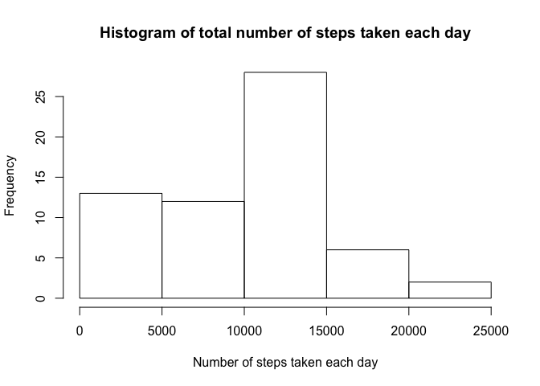

# Reproducible Research: Peer Assessment 1


## Loading and preprocessing the data
Show any code that is needed to

1. Load the data (i.e., read_csv())

```r
activity <- read.csv("activity.csv")
```
2. Process/transform the data (if necessary) into a format suitable for your analysis

The only thing I've done here is change the date column from a factor to a date that is needed for the weekdays() function in the final part of the assignment.

```r
activity$date <- as.Date(as.character(activity$date), "%Y-%m-%d")
```

```
## Warning in strptime(x, format, tz = "GMT"): unknown timezone 'zone/tz/
## 2017c.1.0/zoneinfo/America/Los_Angeles'
```

```r
str(activity)
```

```
## 'data.frame':	17568 obs. of  3 variables:
##  $ steps   : int  NA NA NA NA NA NA NA NA NA NA ...
##  $ date    : Date, format: "2012-10-01" "2012-10-01" ...
##  $ interval: int  0 5 10 15 20 25 30 35 40 45 ...
```


## What is mean total number of steps taken per day?
For this part of the assignment, you can ignore the missing values in the dataset.

1. Calculate the total number of steps taken per day.

```r
totalStepsByDate <- aggregate(activity$steps, by=list(activity$date), FUN=sum, na.rm=TRUE)
```
2. Make a histogram of the total number of steps taken each day.

```r
hist(totalStepsByDate[, 2], main="Histogram of total number of steps taken each day", xlab="Number of steps taken each day")
```

<!-- -->

3. Calculate and report the mean and median of the total number of steps taken per day.

```r
mean(totalStepsByDate[, 2])
```

```
## [1] 9354.23
```

```r
median(totalStepsByDate[, 2])
```

```
## [1] 10395
```


## What is the average daily activity pattern?
1. Make a time series plot (i.e. type="l") of the 5-minute interval (x-axis) and the average number of steps taken, averaged across all days (y-axis)

```r
meanStepsByInterval <- aggregate(activity$steps, by=list(activity$interval), FUN=mean, na.rm=TRUE)
plot(x=meanStepsByInterval[, 1], y=meanStepsByInterval[, 2], type="l", xlab="5-minute interval", ylab="Average number of steps taken")
grid()
```

<!-- -->

2. Which 5-minute interval, on average across all the days in the dataset, contains the maximum number of steps?

```r
meanStepsByInterval[which.max(meanStepsByInterval[, 2]), 1]
```

```
## [1] 835
```


## Imputing missing values
Note that there are a number of days/intervals where there are missing values (coded as NA). The presence of missing days may introduce bias into some calculations or summaries of the data.

1. Calculate and report the total number of missing values in the dataset (i.e. the total number of rows with NAs)

```r
colSums(is.na(activity))
```

```
##    steps     date interval 
##     2304        0        0
```
2. Devise a strategy for filling in all of the missing values in the dataset. The strategy does not need to be sophisticated. For example, you could use the mean/median for that day, or the mean for that 5-minute interval, etc.

I've chosen to use the mean for that 5-minute interval for the imputed missing values.

3. Create a new dataset that is equal to the original dataset but with the missing data filled in.

```r
activity2 <- activity
naRows <- which(is.na(activity2$steps))
activity2[naRows, 1] <- sapply(activity2[naRows, 3], function(x) meanStepsByInterval[match(x, meanStepsByInterval[, 1]), 2])
summary(activity2)
```

```
##      steps             date               interval     
##  Min.   :  0.00   Min.   :2012-10-01   Min.   :   0.0  
##  1st Qu.:  0.00   1st Qu.:2012-10-16   1st Qu.: 588.8  
##  Median :  0.00   Median :2012-10-31   Median :1177.5  
##  Mean   : 37.38   Mean   :2012-10-31   Mean   :1177.5  
##  3rd Qu.: 27.00   3rd Qu.:2012-11-15   3rd Qu.:1766.2  
##  Max.   :806.00   Max.   :2012-11-30   Max.   :2355.0
```
4. Make a histogram of the total number of steps taken each day and Calculate and report the mean and median total number of steps taken per day. Do these values differ from the estimates from the first part of the assignment? What is the impact of imputing missing data on the estimates of the total daily number of steps?

```r
totalStepsByDate2 <- aggregate(activity2$steps, by=list(activity2$date), FUN=sum, na.rm=TRUE)
hist(totalStepsByDate2[, 2], main="Histogram of total number of steps taken each day", xlab="Total number of steps taken each day")
mtext("(After imputing missing values with interval average)")
```

<!-- -->

```r
mean(totalStepsByDate2[, 2])
```

```
## [1] 10766.19
```

```r
median(totalStepsByDate2[, 2])
```

```
## [1] 10766.19
```
Mean and median differ from the estimates in the first part of the assignment.  Both values increased wioth the mean going from 9354.23 -> 10766.19 and the median went from 10395 -> 10766.19


## Are there differences in activity patterns between weekdays and weekends?
For this part the weekdays() function may be of some help here. Use the dataset with the filled-in missing values for this part.

1. Create a new factor variable in the dataset with two levels – “weekday” and “weekend” indicating whether a given date is a weekday or weekend day.

```r
activity2$dayType <- "weekday"
activity2$dayType[weekdays(activity2$date) %in% c("Saturday", "Sunday")] <- "weekend"
activity2$dayType <- as.factor(activity2$dayType)
str(activity2)
```

```
## 'data.frame':	17568 obs. of  4 variables:
##  $ steps   : num  1.717 0.3396 0.1321 0.1509 0.0755 ...
##  $ date    : Date, format: "2012-10-01" "2012-10-01" ...
##  $ interval: int  0 5 10 15 20 25 30 35 40 45 ...
##  $ dayType : Factor w/ 2 levels "weekday","weekend": 1 1 1 1 1 1 1 1 1 1 ...
```

2. Make a panel plot containing a time series plot (i.e. 𝚝𝚢𝚙𝚎 = "𝚕") of the 5-minute interval (x-axis) and the average number of steps taken, averaged across all weekday days or weekend days (y-axis). See the README file in the GitHub repository to see an example of what this plot should look like using simulated data.

```r
meanStepsByDayTypeByInterval <- aggregate(activity2$steps, by=list(activity2$dayType, activity2$interval), FUN=mean, na.rm=TRUE)
```

**This is closest to the the plot asked for (using ggplot2 rather than lattice):**


```r
library(ggplot2)
ggplot(meanStepsByDayTypeByInterval, aes(x=Group.2, y=x, colour=Group.1)) + 
    geom_line() + 
    #geom_smooth(method="loess") + 
    facet_grid(Group.1 ~ .) + 
    labs(x="Interval", y="Number of steps") +
    theme(legend.position="none")
```

<!-- -->

**but I prefer this one.**


```r
library(ggplot2)
ggplot(meanStepsByDayTypeByInterval, aes(x=Group.2, y=x, colour=Group.1)) + 
    geom_line() + 
    geom_smooth(method="loess") + 
    facet_grid(. ~ Group.1) + 
    labs(x="Interval", y="Number of steps") +
    theme(legend.position="none") + 
    ylim(0, 250)
```

```
## Warning: Removed 17 rows containing missing values (geom_smooth).
```

<!-- -->
